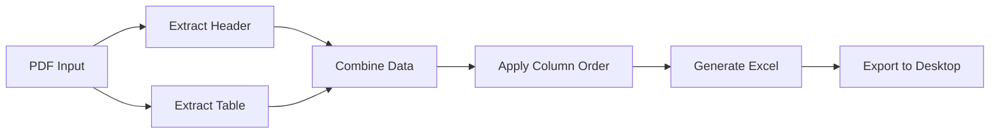

# 📄 Result Extractor

[](https://python.org)
[](LICENSE)
[]()

A Python application that extracts structured data from a specific PDFs model containing **header sections + data tables** and converts them into **clean Excel spreadsheets**, created for a specific work situation.

## ✨ Features

- 📥 **PDF Parsing** - Extracts both header fields and table data using pdfplumber
- 🎯 **Custom Column Order** - Define exact column order via configuration file
- 🖥️ **GUI & CLI** - User-friendly graphical interface + command-line option
- 📦 **Standalone Executable** - No Python installation required for end users (via PyInstaller)
- 🗂️ **Multi-table Support** - Process multiple tables in one PDF
- ⚡ **Timestamped Output** - Automatic file naming with timestamps (e.g., `exported_2025-03-09_14-30-00.xlsx`)

## 🚀 Demo Output

```bash
📊 Processing: invoice_2025.pdf
✅ Header fields extracted: 8
✅ Table rows extracted: 45
✅ Excel file saved: exported_2025-03-09_14-30-00.xlsx
```

## 📋 Prerequisites

- [Python](https://www.python.org/) (version 3.8 or higher)
- [Git](https://git-scm.com/) (optional, for cloning the repository)
- Windows, Linux, or macOS

## 🔧 Installation

### 1. Clone the repository

```bash
git clone https://github.com/felipetoigo/result-extractor.git
cd result-extractor
```

### 2. Create a virtual environment (recommended)

```bash
python3 -m venv .venv
source .venv/bin/activate   # On Windows: .venv\Scripts\activate
```

### 3. Install dependencies

```bash
pip install -r requirements.txt
```

## 📖 Usage

### GUI Mode (Recommended)

```bash
python gui.py
```

A window opens with an **Import and Convert** button. Click it to choose a PDF (only PDF files are shown in the file picker). The file dialog opens in the **pdf-to-convert** folder if it exists—place your PDF there for convenience. The spreadsheet (header data + table) is saved on your **Desktop** as **exported_&lt;timestamp&gt;.xlsx**.

### Command Line

```bash
# Output file will be input.pdf → input.xlsx (same directory)
python main.py path/to/input.pdf

# Specify output path
python main.py path/to/input.pdf -o path/to/output.xlsx

# Use all tables in the PDF (default: first table only)
python main.py input.pdf --all-tables
```

## ⚙️ Configuration

Edit `result_extractor/config.py` to customize the output:

- **`OUTPUT_COLUMN_ORDER`**  
  Set the desired column order in the output Excel file. Use either:
  - **Header names**: exact strings as they appear in the PDF table (e.g., `["Name", "Date", "Result"]`), or
  - **0-based indices**: e.g., `[0, 2, 1]` to put column 0 first, then 2, then 1.

- **`HAS_HEADER_ROW`**  
  Set to `True` if the first row of the table is a header; set to `False` if there is no header (then use indices in `OUTPUT_COLUMN_ORDER`).

- **`OUTPUT_SHEET_NAME`**  
  Name of the sheet in the generated workbook (optional).

### First-Time Setup Workflow

1. Run once with the current (empty) column order to see the extracted table:
   ```bash
   python main.py yourfile.pdf -o preview.xlsx
   ```
2. Open `preview.xlsx` to see the headers and column order.
3. Update `OUTPUT_COLUMN_ORDER` in `result_extractor/config.py` with the desired order.
4. Run again to generate the final XLSX with columns in the right order.

## 🔍 How It Works



1. **PDF Parsing** - Reads the PDF and extracts both header fields and table data
2. **Data Extraction** - Identifies and extracts structured data from the document
3. **Column Ordering** - Applies your custom column order configuration
4. **Excel Generation** - Creates a clean Excel file with all data properly formatted
5. **Export** - Saves the file to your Desktop with a timestamp

## 📁 Project Structure

```
result-extractor/
├── gui.py                  # GUI application (Import and Convert)
├── main.py                 # CLI entry point
├── pdf-to-convert/         # Place PDFs here; file dialog opens in this folder
├── result_extractor/
│   ├── __init__.py
│   ├── config.py          # Column order and options
│   ├── pdf_reader.py      # PDF header + table extraction (pdfplumber)
│   ├── excel_writer.py    # XLSX: header section (Field, Value) + table
│   └── converter.py       # Orchestration: convert_pdf_to_spreadsheet()
├── requirements.txt
├── .gitignore
└── README.md
```

## 🛠️ Building Executables

You can build standalone executables so others can run the tool without installing Python.

### 1. Install PyInstaller

```bash
pip install pyinstaller
```

### 2. Build for your platform

**On macOS**:
```bash
pyinstaller --onefile --name result-extractor-mac gui.py
```
The executable will be in `dist/result-extractor-mac`.

**On Windows**:
```cmd
pyinstaller --onefile --name result-extractor-win gui.py
```
The executable will be in `dist\result-extractor-win.exe`.

> **Note:** Build the Windows executable on a Windows machine and the Mac executable on a Mac (or use CI). PyInstaller produces an executable for the OS it runs on.

## 🎯 Customization

### Add New PDF Formats

To support new PDF structures, modify `pdf_reader.py` to handle different layouts:

```python
def extract_custom_format(pdf_path):
    # Your custom extraction logic here
    pass
```

### Change Output Location

Modify `OUTPUT_PATH` in `config.py` to change where files are saved:

```python
OUTPUT_PATH = "C:\\MyDocuments\\Exports"  # Custom path
```

### Add New Output Formats

Extend `excel_writer.py` to support other formats like CSV or JSON:

```python
def export_to_csv(data, output_path):
    # CSV export logic
    pass
```

## ⚠️ Troubleshooting

### Common Issues

| Issue | Solution |
|-------|----------|
| **"Module not found"** | Ensure `pip install -r requirements.txt` was run |
| **PDF not extracting correctly** | Check if the PDF is text-based (not scanned). For scanned PDFs, consider adding OCR support |
| **GUI doesn't open** | Make sure Python has Tkinter installed (`python -m tkinter`) |
| **Column order not applying** | Verify `OUTPUT_COLUMN_ORDER` matches exactly the header names or valid indices |
| **File permission errors** | Close the Excel file if it's open, or check write permissions |

### Debugging Tips

```bash
# Run with verbose output
python main.py input.pdf -o output.xlsx --verbose

# Test PDF extraction only (skip Excel generation)
python -c "from result_extractor import pdf_reader; print(pdf_reader.extract_table('input.pdf'))"
```

## 🧪 Testing

Run the test suite:

```bash
pip install pytest
pytest tests/
```

## 🤝 Contributing

Contributions are welcome! Here's how you can help:

1. Fork the project
2. Create a feature branch (`git checkout -b feature/amazing-feature`)
3. Commit your changes (`git commit -m 'Add some amazing feature'`)
4. Push to the branch (`git push origin feature/amazing-feature`)
5. Open a Pull Request

### Development Setup

```bash
# Install development dependencies
pip install -r requirements-dev.txt

# Run tests
pytest

# Check code style
flake8 result_extractor/
```

## 📝 License

This project is licensed under the MIT License - see the [LICENSE](LICENSE) file for details.

## 🙏 Acknowledgments

- [pdfplumber](https://github.com/jsvine/pdfplumber) - PDF parsing library
- [openpyxl](https://openpyxl.readthedocs.io/) - Excel file generation
- [PyInstaller](https://www.pyinstaller.org/) - Standalone executable builder
- [Tkinter](https://docs.python.org/3/library/tkinter.html) - GUI framework

## 📞 Contact

Felipe Toigo - [GitHub](https://github.com/felipetoigo)

---

⭐ **If this project helped you, please consider giving it a star!**
